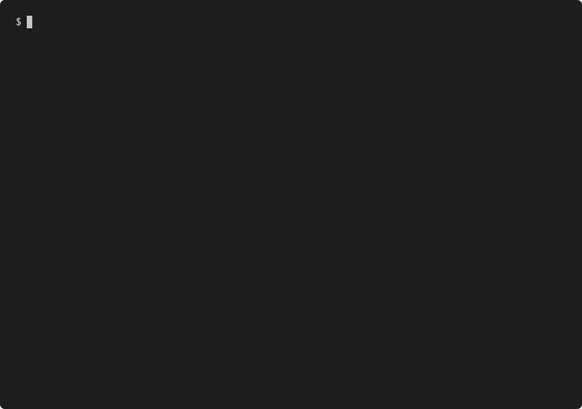

<p align="center">
	
	<h1 align="center">BSQ</h1>
</p>
<p align="center">
	
	
</p>

<p align="center">
	<b><i>Development repository for the 42cursus BSQ project @ 42 Heilbronn</i></b><br>
</p>

<p align="center">
	
	
	
	
</p>
<br>

> _Summary: Algorithm to find the biggest square in a text file._

> _This is a remake of the last project of C Piscine, intended to help testing the solutions of a group activity taking place @ 42 Heilbronn._

<br>

<p align="center">
	<table>
		<tr>
			<td><b>Est. Time</b></td>
			<td><b>Skills</b></td>
			<td><b>Allowed Functions</b></td>
			<td><b>Difficulty</b></td>
		</tr>
		<tr>
			<td valign="top">about 1 day</td>
			<td valign="top">
			
			
			
			
			</td>
			<td valign="top">
			
			
			
			
			
			
			
			</td>
			<td valign="top"> 225 XP</td>
		</tr>
	</table>
</p>

<br>

### Info
> This program can run in `debug` or `release` versions, with the debug printing the output on each step of finding a solution.

> This program can run in `square (default)` or `retangle` modes, finding the biggest shape accordingly.

### Usage
```bash
$ make								# builds the default version: release/square
$ make debug						# builds the default debug version: debug/square
$ make rectangle					# builds the rectangle version: release/rectangle
$ make rectangle debug				# builds the rectangle debug version: debug/rectangle
$ ./bsq textfile
```

### Example of textfile
```bash
20.ox
..................o...o....o..o......o...............................
........................o...........................o................
............o..o..............................o.......o..............
..............................o.....o................................
..........................................o............o.o..o.....o..
....o..........................................o.....................
........................o...o.........o................o...........o.
......o..............................................................
...............................o...................o.....o...........
....................o................................o...............
.o......o....................................o............o.........o
........................................o..........o.............o...
.o......................o............................................
....................o..................o................o............
......................o.........o................o...................
....................o..................o................o............
.....................o.................o...........o............o....
.......................o....o................o.......................
....................o......................o............o............
............o..........o..o........o.................................
```

## Results for the example above:

### default

```bash
$ make					# builds the default version: release/square
$ ./bsq textfile
```


### debug

```bash
$ make debug			# builds the default debug version: debug/square
$ ./bsq textfile
```


### rectangle

```bash
$ make rectangle		# builds the rectangle version: release/rectangle
$ ./bsq textfile
```



### rectangle debug

```bash
$ make rectangle debug	# builds the rectangle debug version: debug/rectangle
$ ./bsq textfile
```


## Multithreading

Multithreading was also added, so that all commands above can run be run in one thread per line of the map:
```bash
$ make multithread
$ make debug multithread
$ make rectangle multithread
$ make rectangle debug multithread
$ ./bsq textfile
```

Multithreading results seems to be a lot faster. In a 10000x10000 map, those are the timing results:
```bash
bsq square release multithread is built. 
       40.72 real       123.10 user         1.86 sys
bsq square release singlethread is built. 
      136.28 real       134.96 user         0.51 sys
bsq rectangle release multithread is built. 
     1911.61 real      7415.45 user         8.13 sys
bsq rectangle release singlethread is built. 
     8061.19 real      8023.46 user         9.32 sys
````
